# Arquitectura de MC Send Notify

Autor: **Ing. Heri Espinosa**

## 1. Visión general

MC Send Notify sigue una **arquitectura hexagonal (puertos y adaptadores)** dentro de un único proyecto Next.js. El mismo código de dominio e infraestructura lo usan dos procesos:

- **App web** (Next.js): interfaz, Server Actions y endpoints HTTP.
- **Worker** (Node.js + BullMQ): trabajo asíncrono como envíos, conversión de documentos, automatizaciones y mantenimiento.

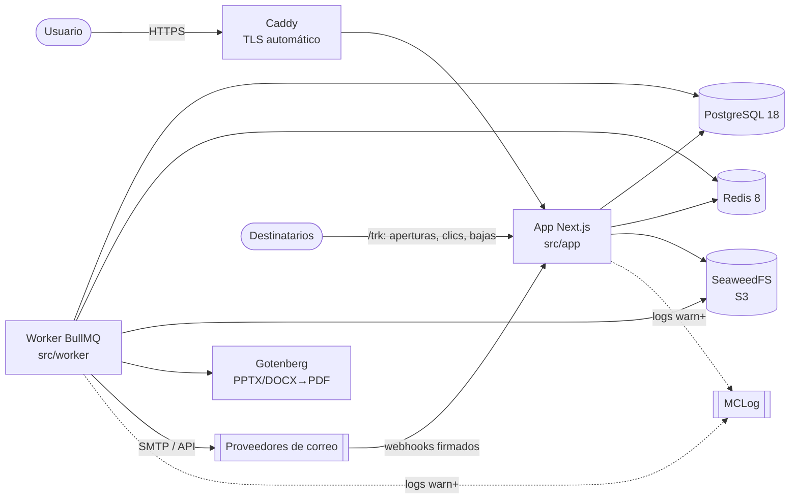

## 2. Capas

| Capa            | Carpeta              | Responsabilidad                                                               | Puede depender de                    |
| --------------- | -------------------- | ----------------------------------------------------------------------------- | ------------------------------------ |
| Dominio         | `src/core`           | Entidades, reglas, casos de uso y puertos (interfaces)                        | Solo `zod` y otros módulos de `core` |
| Infraestructura | `src/infrastructure` | Adaptadores de los puertos: Prisma, Redis/BullMQ, proveedores, observabilidad | `core`, `common` y librerías         |
| Worker          | `src/worker`         | Procesadores de colas, programaciones y salud del proceso                     | `core`, `infrastructure`, `common`   |
| Presentación    | `src/app`            | Rutas, layouts, Server Components, Server Actions y API                       | Todas las anteriores                 |
| UI              | `src/components`     | Componentes Atomic Design                                                     | `common`; nunca infraestructura      |
| Transversal     | `src/common`         | Configuración, tema, i18n y utilidades puras                                  | Librerías                            |

Los límites se **hacen cumplir con ESLint** (`no-restricted-imports` en [eslint.config.mjs](../eslint.config.mjs)):

- `core` no puede importar Next.js, React, MUI, Prisma, BullMQ, Redis, pino ni configuración de entorno.
- `infrastructure` y `worker` no pueden importar la presentación ni frameworks de UI.
- `components` no puede importar infraestructura.

### Composition root

[src/infrastructure/container.ts](../src/infrastructure/container.ts) crea las dependencias compartidas: logger, Prisma, Redis y comprobaciones de salud. Usa fábricas con singleton perezoso guardado en `globalThis`, para que el HMR de desarrollo no abra conexiones duplicadas. No se usa ninguna librería de inyección de dependencias: los casos de uso reciben sus puertos desde aquí.

Como los casos de uso memoizados se comparten entre las capas de Next.js (páginas y route handlers cargan copias distintas de un mismo módulo), los errores de dominio se reconocen por una marca global (`Symbol.for`) y no solo con `instanceof`.

## 3. Flujo de una petición web

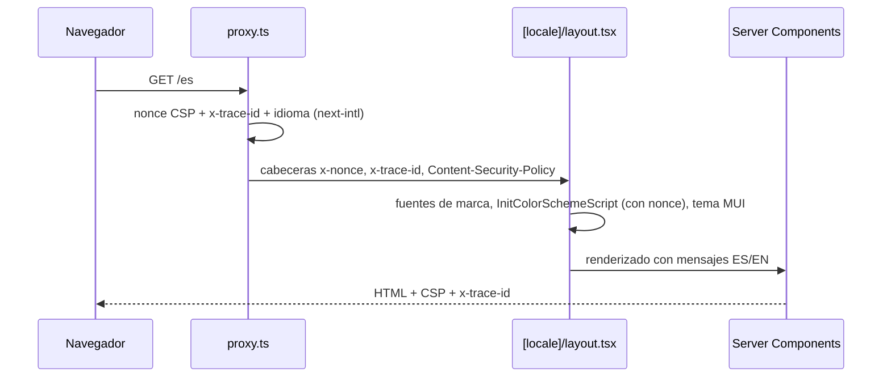

- El **proxy** ([src/proxy.ts](../src/proxy.ts)) se ejecuta en todas las páginas, pero no en `/api`, `/trk` ni en los archivos estáticos.
- El **nonce** se aplica a los scripts de Next.js, al script de esquema de color de MUI y a la caché de Emotion.
- El **traceId** se propaga a los logs y, en fases posteriores, a los jobs de las colas.

## 4. Flujo del worker

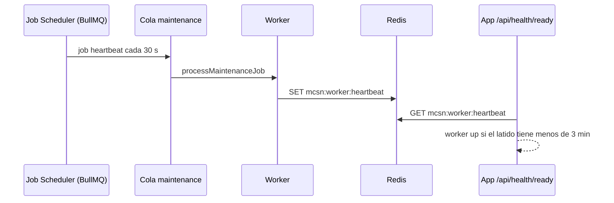

El latido prueba de extremo a extremo que Redis funciona, que el scheduler programa jobs y que el worker los procesa.

Colas activas:

| Cola                | Fase | Job id                                    | Uso                                                                       |
| ------------------- | ---- | ----------------------------------------- | ------------------------------------------------------------------------- |
| `maintenance`       | 0    | por scheduler                             | Latido; barridos de campañas programadas, terminadas y entregas atascadas |
| `contact-import`    | 1    | `import-{id}`                             | Importación de CSV o Excel                                                |
| `document-process`  | 2    | `document-{id}-{marca de tiempo}`         | Conversión, miniatura y texto                                             |
| `campaign-dispatch` | 3    | `dispatch-{campaignId}-{version}`         | Crear las entregas de una campaña y encolarlas                            |
| `email-send`        | 3    | `delivery-{deliveryId}`                   | Enviar una entrega (6 intentos, backoff exponencial)                      |
| `provider-events`   | 3    | `event-{id}`                              | Aplicar eventos de webhooks (rebotes, quejas, entregas)                   |
| `system-mail`       | 3    | aleatorio                                 | Invitaciones, recuperación de contraseña y solicitudes de aprobación      |
| `automation-run`    | 4    | `automation-{id}-{clave}` o del scheduler | Ejecución de una automatización (3 intentos)                              |

Cada automatización activa tiene un Job Scheduler `automation-{id}` (cron + zona horaria) que el worker vuelve a registrar al arrancar. La cola `maintenance` añade el barrido `approvals-expire` (cada minuto). La asistencia con IA del editor se ejecuta en la Server Action (sin cola): Next.js autohospedado no impone un límite de tiempo a las acciones y el SDK tiene un tiempo máximo de 120 s. La cola `outbound-webhook` llega en la Fase 5. BullMQ no admite `:` en los nombres de cola.

## 5. Multi-tenancy

Cada **tenant** es una aplicación o producto de Multicómputos. El aislamiento se aplica en tres capas (ver [ADR 0005](adr/0005-tenant-isolation.md)):

1. **Dominio:** cada caso de uso recibe un `TenantContext` explícito y comprueba el permiso con `assertCan`.
2. **Datos:** los repositorios usan `TenantClientCache.forTenant(tenantId)`, una extensión de Prisma que añade `tenantId` a toda lectura, actualización y borrado, lo fija en las creaciones y rechaza escrituras anidadas o hacia otro tenant ([tenant-scope.extension.ts](../src/infrastructure/persistence/prisma/tenant-scope.extension.ts)).
3. **Guardias:** un test compara `schema.prisma` con la lista de modelos con tenant, y los tests de integración prueban que ningún repositorio cruza tenants, incluso dentro de transacciones.

Las consultas SQL en bruto (segmentos y upsert por lotes) filtran `tenant_id` de forma explícita, y las referencias que llegan del cliente (listas, etiquetas, temas) se validan contra el tenant antes de usarlas.

El `tenantId` nunca se acepta desde el cliente. `requireTenant(slug)` lo resuelve a partir del _slug_ de la URL y de la membresía del usuario. Si no hay acceso, la respuesta es 404 y no revela si el tenant existe.

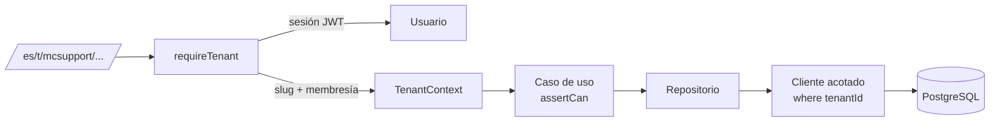

## 6. Autenticación y autorización

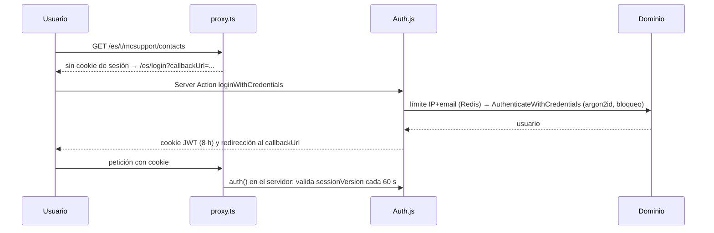

- **Credenciales y Microsoft Entra ID** ([ADR 0004](adr/0004-authentication.md)). El SSO solo admite dominios de `AUTH_ALLOWED_EMAIL_DOMAINS`.
- **Roles por tenant:** Propietario, Administrador, Editor y Lector. Los permisos están en [permissions.ts](../src/core/identity/permissions.ts). Un super-administrador de plataforma accede a cualquier tenant como Propietario y su actividad queda auditada.
- **Server Actions:** `tenantAction(schema, handler)` encadena sesión, tenant, validación Zod, caso de uso y traducción de errores ([action-client.ts](../src/app/_server/action-client.ts)).
- **API pública:** las claves `mcsn_{prefijo}_{secreto}` se guardan como SHA-256, tienen permisos (_scopes_), caducidad y revocación.

## 7. Importación de contactos

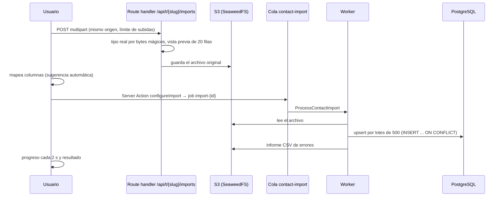

El rendimiento medido es de unos 9 s para 10.000 filas, frente al objetivo de 60 s.

## 8. Plantillas y compilación de correos

Las plantillas guardan un cuerpo validado con Zod en uno de tres formatos: bloques, Markdown o HTML. Cada guardado crea una `TemplateVersion` inmutable, protegida por un trigger. El guardado usa concurrencia optimista: si otra persona guardó antes, se devuelve `CONFLICT` sin pisar su trabajo. Restaurar crea una versión nueva con el contenido antiguo.

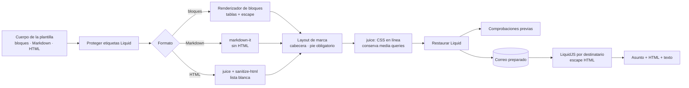

- `prepare` se ejecuta una vez; `personalize` sustituye las variables de cada destinatario. La Fase 3 reutiliza ambos para los envíos.
- La **vista previa** usa el mismo compilador con un contacto real o de ejemplo. Se muestra en un `<iframe sandbox="" srcdoc>`, sin scripts ni acceso a la sesión.
- Los **enlaces de baja y preferencias** son variables de sistema. En la vista previa apuntan a anclas inocuas; en la Fase 3 serán URL firmadas.
- Las decisiones están en el [ADR 0006](adr/0006-email-rendering.md).

## 9. Documentos y miniaturas

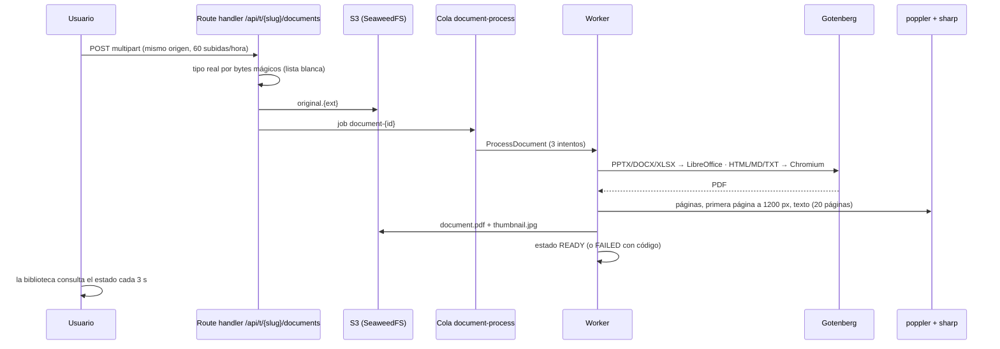

En los correos, la tarjeta del documento muestra la miniatura desde `/trk/i/{token}` y enlaza la descarga en `/trk/d/{token}`. Ambas son URL firmadas con HMAC, públicas y sin caducidad. En la interfaz los archivos se sirven con sesión desde `/api/t/{slug}/documents/{id}/file`. El detalle está en el [ADR 0007](adr/0007-document-processing.md).

## 10. Campañas y envío

Estados de una campaña:

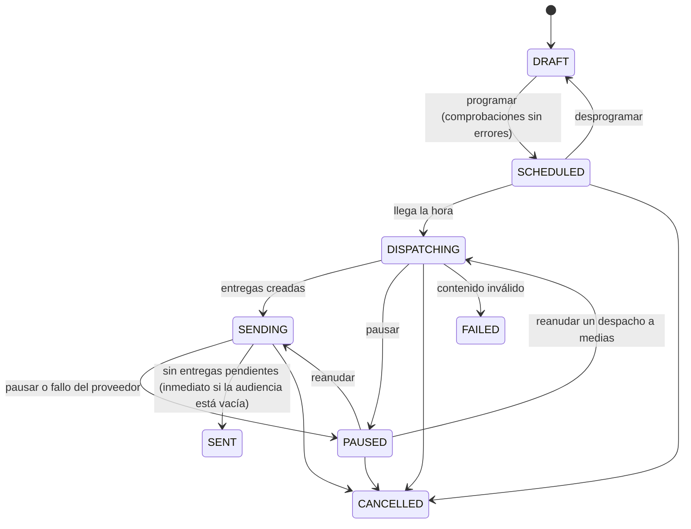

Flujo de envío:

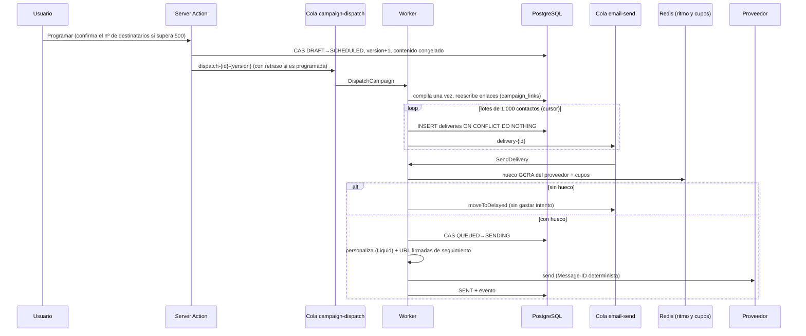

Claves del diseño (detalle en el [ADR 0008](adr/0008-sending-pipeline.md)):

- **Exactamente una entrega por contacto** gracias a la clave única `(campaign_id, contact_id)` y a las transiciones CAS. Un despacho repetido o reanudado no duplica nada.
- **Audiencia en SQL** (`SqlAudienceResolver`):
  - suma de listas y segmentos, con contactos únicos;
  - excluye las listas excluidas, los contactos no activos, las supresiones del tenant y las bajas del tema de la campaña.
- **Supresión comprobada dos veces:** al despachar y justo antes de enviar. Una baja recibida durante el envío se respeta.
- **Pausa, reanudación y cancelación:** las entregas pendientes se quedan en `QUEUED` y el worker las ignora mientras la campaña no esté en `SENDING`.
- **Circuit breaker:** un error de autenticación o configuración marca el proveedor con `ERROR` y pausa sus campañas.
- **Proveedores** (patrón Strategy, `EmailProviderFactory`):
  - `SmtpEmailProvider` (nodemailer, con protección SSRF);
  - `GraphEmailProvider` (Microsoft 365, MIME en base64);
  - `ResendEmailProvider` (`Idempotency-Key`);
  - `SesEmailProvider` (SES v2, _raw_).
- **Caché de clientes:** `CachingEmailProviderGateway` los cachea por `configVersion`.
- **Barridos de mantenimiento:** cada 15 s se lanzan las campañas programadas vencidas. Cada 60 s se cierran las terminadas y se recuperan las entregas en `SENDING` de más de 10 minutos.

## 11. Seguimiento, bajas y webhooks

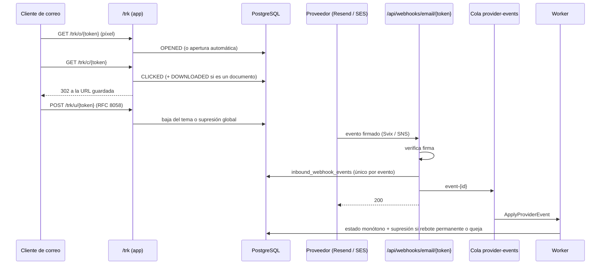

- **URL firmadas:** HMAC-SHA256 con un dominio propio (`mcsn-track-v1`) y un propósito por tipo de enlace. La carga solo lleva identificadores, nunca el email ni la URL de destino.
- **Rutas fuera del idioma:** las rutas `/trk/*` y `/api/*` quedan fuera de `[locale]` y del matcher de `proxy.ts`, para que respondan rápido y sin cookies.
- **Centro de preferencias** (`/{locale}/preferences/{token}`):
  - página pública que muestra el email enmascarado;
  - permite elegir temas o darse de baja de todo, con una Server Action validada con Zod.
- **Detalle de las decisiones:** [ADR 0009](adr/0009-tracking-unsubscribe-webhooks.md).

## 12. Correo del sistema

Las invitaciones y la recuperación de contraseña no dependen de los proveedores de los tenants.

- **Envío:** la Server Action encola en `system-mail` y el worker envía por `SYSTEM_MAIL_SMTP_URL` con `SmtpSystemMailer`.
- **Plantillas:** propias en español e inglés, con los datos escapados.
- **Recuperación de contraseña:**
  - el token es aleatorio y se guarda solo su hash, en `verification_tokens` con identificador `password-reset:{userId}`;
  - caduca en una hora, es de un solo uso (borrado atómico) y una solicitud nueva invalida la anterior;
  - la respuesta es siempre neutra, para no revelar si la cuenta existe.
  - al cambiar la contraseña, `sessionVersion` se incrementa y se cierran las sesiones abiertas.

## 13. Inteligencia artificial

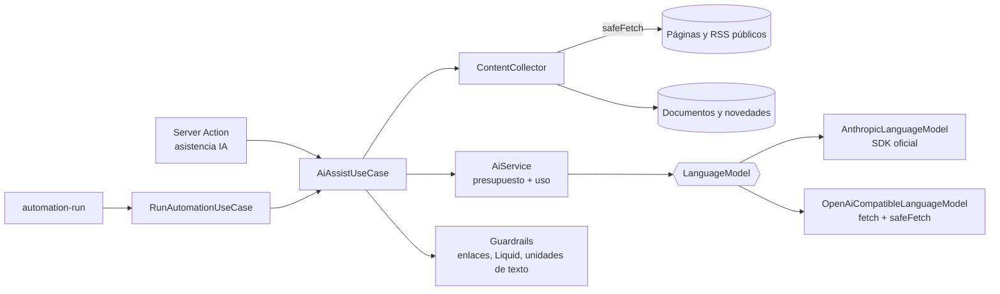

- **`AiService`** es la puerta única:
  - resuelve la configuración del tenant (plataforma o clave propia, descifrada con AAD) y comprueba el presupuesto del mes;
  - llama al modelo y registra tokens, coste y latencia en `ai_usage`, también en los errores;
  - traduce los errores a motivos estables (`AI_BUDGET_EXCEEDED`, `AI_REFUSED`...).
- **`AiAssistUseCase`:**
  - borrador desde fuentes, asuntos (con heurística local de riesgo), traducción y tono por unidades de texto;
  - segmentos (nombres de listas y etiquetas → ids, validados con el catálogo) y resumen de resultados.
- **Salida estructurada:** cada uso define un esquema Zod plano que se convierte a JSON Schema para la API y se valida de nuevo al recibirlo.
- **Detalle de las decisiones:** [ADR 0011](adr/0011-ai-integration.md).

## 14. Automatizaciones y aprobaciones

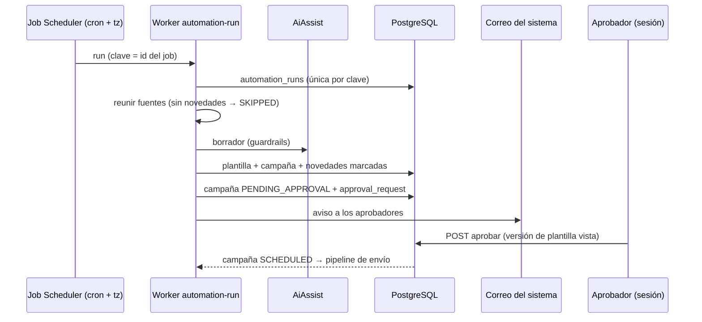

- Pasos guardados en la ejecución: un reintento tras una caída no duplica plantilla ni campaña.
- La campaña es la fuente de verdad en las decisiones concurrentes (CAS de estado).
- **Detalle de las decisiones:** [ADR 0012](adr/0012-automations-approvals.md).

## 15. Diseño de la UI

- **Atomic Design:**
  - `atoms`: `BrandLogo`, `StatusChip`, `ColorSwatch` (SVG, sin estilos en línea).
  - `molecules`: `PageHeader`, `StatCard`, `ConfirmDialog`, `CopyField`, `LinkButton`, `EmptyState`, `ThemeToggle`, `LocaleSwitcher`, `FileDropzone`, `EmailPreviewFrame`.
  - `organisms`: `AppShell`, `ContactsDataGrid`, `ContactForm`, `ImportUploader`, `ImportMapper`, `SegmentEditor`, `MembersManager`, `ApiKeysManager`, `TemplatesTable`, `TemplateEditor`, `BlockEditor`, `DocumentsManager`, `DocumentActions`, `BrandingForm`, `ProvidersManager`, `SendersManager`, `CampaignsTable`, `CampaignEditor` (Stepper de 5 pasos), `CampaignReport` (DataGrid con paginación en servidor), `ActivityChart` (MUI X Charts con tabla alternativa accesible), `PreferencesForm`, `PasswordResetForms`, `AiSettingsForm`, `AiDraftDialog`, `TemplateAiTools`, `CampaignAiSummary`, `ChangelogManager`, `AutomationsTable`, `AutomationEditor`, `AutomationRuns`, `ApprovalsTable`, `ApprovalReview`, etc.; molecules nuevas `SourcesEditor` y `MultiSelectField`.
- **Server Components** cargan los datos; los componentes cliente solo reciben datos serializables y llaman a Server Actions.
- **Tailwind y MUI conviven** mediante capas CSS (`@layer theme, base, mui, components, utilities`). Las variables CSS que genera MUI (prefijo `--mc-`) se exponen como colores de Tailwind (`bg-primary`, `text-ink-muted`...), con una sola fuente de verdad en [src/common/theme/tokens.ts](../src/common/theme/tokens.ts).
- **Modo oscuro** por clase en `<html>`, compartido por MUI y Tailwind, sin parpadeo inicial.
- **`loading.tsx`** en las páginas del tenant muestra un esqueleto y limita el _prefetch_ de los enlaces del menú.
