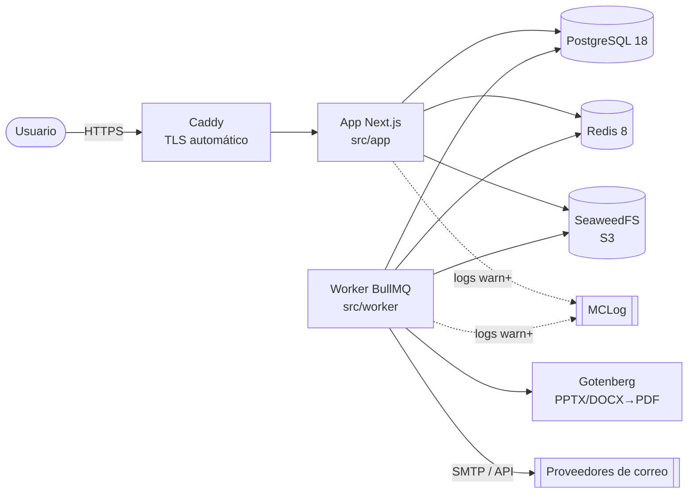
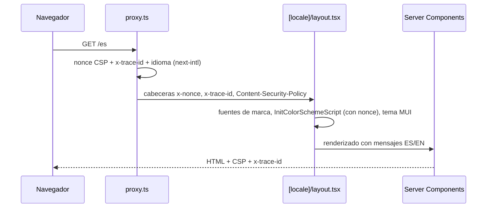
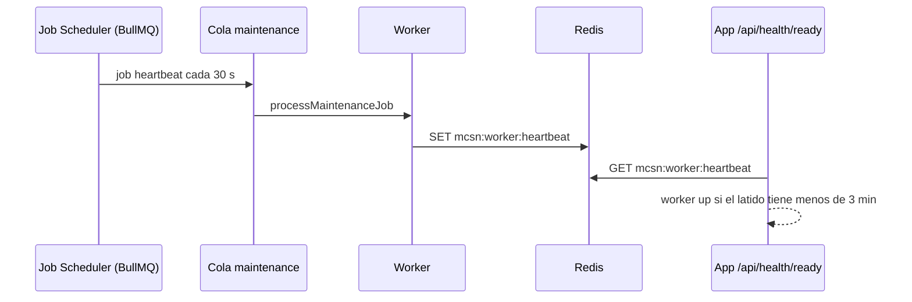
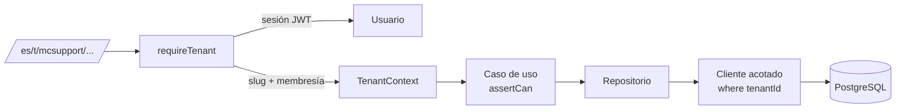
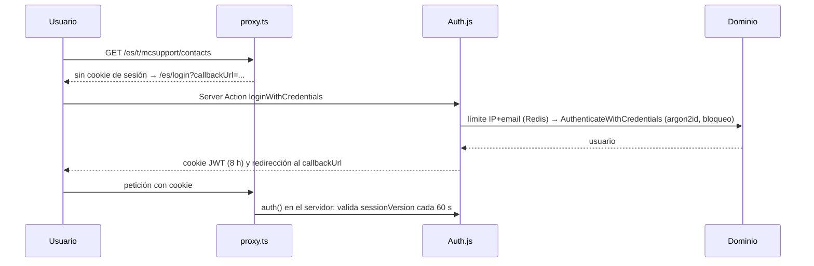
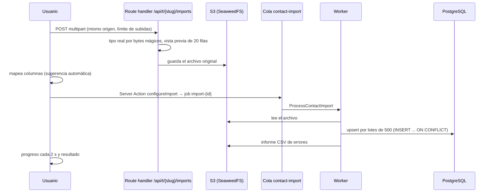

# Arquitectura de MC Send Notify

Autor: **Ing. Heri Espinosa**

## 1. Visión general

MC Send Notify sigue una **arquitectura hexagonal (puertos y adaptadores)** dentro de un único proyecto Next.js. El mismo código de dominio e infraestructura lo usan dos procesos:

- **App web** (Next.js): interfaz, Server Actions y endpoints HTTP.
- **Worker** (Node.js + BullMQ): trabajo asíncrono como envíos, conversión de documentos, automatizaciones y mantenimiento.

## 2. Capas

| Capa            | Carpeta              | Responsabilidad                                                               | Puede depender de                    |
| --------------- | -------------------- | ----------------------------------------------------------------------------- | ------------------------------------ |
| Dominio         | `src/core`           | Entidades, reglas, casos de uso y puertos (interfaces)                        | Solo `zod` y otros módulos de `core` |
| Infraestructura | `src/infrastructure` | Adaptadores de los puertos: Prisma, Redis/BullMQ, proveedores, observabilidad | `core`, `common` y librerías         |
| Worker          | `src/worker`         | Procesadores de colas, programaciones y salud del proceso                     | `core`, `infrastructure`, `common`   |
| Presentación    | `src/app`            | Rutas, layouts, Server Components, Server Actions y API                       | Todas las anteriores                 |
| UI              | `src/components`     | Componentes Atomic Design                                                     | `common`; nunca infraestructura      |
| Transversal     | `src/common`         | Configuración, tema, i18n y utilidades puras                                  | Librerías                            |

Los límites se **hacen cumplir con ESLint** (`no-restricted-imports` en [eslint.config.mjs](../eslint.config.mjs)):

- `core` no puede importar Next.js, React, MUI, Prisma, BullMQ, Redis, pino ni configuración de entorno.
- `infrastructure` y `worker` no pueden importar la presentación ni frameworks de UI.
- `components` no puede importar infraestructura.

### Composition root

[src/infrastructure/container.ts](../src/infrastructure/container.ts) crea las dependencias compartidas: logger, Prisma, Redis y comprobaciones de salud. Usa fábricas con singleton perezoso guardado en `globalThis`, para que el HMR de desarrollo no abra conexiones duplicadas. No se usa ninguna librería de inyección de dependencias: los casos de uso reciben sus puertos desde aquí.

## 3. Flujo de una petición web

- El **proxy** ([src/proxy.ts](../src/proxy.ts)) se ejecuta en todas las páginas, pero no en `/api`, `/trk` ni en los archivos estáticos.
- El **nonce** se aplica a los scripts de Next.js, al script de esquema de color de MUI y a la caché de Emotion.
- El **traceId** se propaga a los logs y, en fases posteriores, a los jobs de las colas.

## 4. Flujo del worker

El latido prueba de extremo a extremo que Redis funciona, que el scheduler programa jobs y que el worker los procesa.

La cola `contact-import` ya está activa (Fase 1). Las colas planificadas para las siguientes fases son `campaign-dispatch`, `send-{providerConfigId}`, `document-process`, `automation-run`, `ai-generate`, `webhook-ingest`, `outbound-webhook`, `system-mail` y `dead-letter`. Están descritas en el plan del proyecto. BullMQ no admite `:` en los nombres de cola.

## 5. Multi-tenancy

Cada **tenant** es una aplicación o producto de Multicómputos. El aislamiento se aplica en tres capas (ver [ADR 0005](adr/0005-tenant-isolation.md)):

1. **Dominio:** cada caso de uso recibe un `TenantContext` explícito y comprueba el permiso con `assertCan`.
2. **Datos:** los repositorios usan `TenantClientCache.forTenant(tenantId)`, una extensión de Prisma que añade `tenantId` a toda lectura, actualización y borrado, lo fija en las creaciones y rechaza escrituras anidadas o hacia otro tenant ([tenant-scope.extension.ts](../src/infrastructure/persistence/prisma/tenant-scope.extension.ts)).
3. **Guardias:** un test compara `schema.prisma` con la lista de modelos con tenant, y los tests de integración prueban que ningún repositorio cruza tenants, incluso dentro de transacciones.

Las consultas SQL en bruto (segmentos y upsert por lotes) filtran `tenant_id` de forma explícita, y las referencias que llegan del cliente (listas, etiquetas, temas) se validan contra el tenant antes de usarlas.

El `tenantId` nunca se acepta desde el cliente. `requireTenant(slug)` lo resuelve a partir del _slug_ de la URL y de la membresía del usuario. Si no hay acceso, la respuesta es 404 y no revela si el tenant existe.

## 6. Autenticación y autorización

- **Credenciales y Microsoft Entra ID** ([ADR 0004](adr/0004-authentication.md)). El SSO solo admite dominios de `AUTH_ALLOWED_EMAIL_DOMAINS`.
- **Roles por tenant:** Propietario, Administrador, Editor y Lector. Los permisos están en [permissions.ts](../src/core/identity/permissions.ts). Un super-administrador de plataforma accede a cualquier tenant como Propietario y su actividad queda auditada.
- **Server Actions:** `tenantAction(schema, handler)` encadena sesión, tenant, validación Zod, caso de uso y traducción de errores ([action-client.ts](../src/app/_server/action-client.ts)).
- **API pública:** las claves `mcsn_{prefijo}_{secreto}` se guardan como SHA-256, tienen permisos (_scopes_), caducidad y revocación.

## 7. Importación de contactos

El rendimiento medido es de unos 9 s para 10.000 filas, frente al objetivo de 60 s.

## 8. Diseño de la UI

- **Atomic Design:**
  - `atoms`: `BrandLogo`, `StatusChip`.
  - `molecules`: `PageHeader`, `StatCard`, `ConfirmDialog`, `CopyField`, `LinkButton`, `EmptyState`, `ThemeToggle`, `LocaleSwitcher`.
  - `organisms`: `AppShell`, `ContactsDataGrid`, `ContactForm`, `ImportUploader`, `ImportMapper`, `SegmentEditor`, `MembersManager`, `ApiKeysManager`, etc.
- **Server Components** cargan los datos; los componentes cliente solo reciben datos serializables y llaman a Server Actions.
- **Tailwind y MUI conviven** mediante capas CSS (`@layer theme, base, mui, components, utilities`). Las variables CSS que genera MUI (prefijo `--mc-`) se exponen como colores de Tailwind (`bg-primary`, `text-ink-muted`...), con una sola fuente de verdad en [src/common/theme/tokens.ts](../src/common/theme/tokens.ts).
- **Modo oscuro** por clase en `<html>`, compartido por MUI y Tailwind, sin parpadeo inicial.
- **`loading.tsx`** en las páginas del tenant muestra un esqueleto y limita el _prefetch_ de los enlaces del menú.
