# Documento técnico de MC Send Notify

Autor: **Ing. Heri Espinosa**

## 1. Decisiones de arquitectura

| ADR                                               | Decisión                                                                                   |
| ------------------------------------------------- | ------------------------------------------------------------------------------------------ |
| [0001](adr/0001-single-project-with-worker.md)    | Proyecto único de Next.js con el worker en `src/worker`, sin monorepo                      |
| [0002](adr/0002-inline-css-in-emails.md)          | El HTML de los correos usa CSS en línea; la regla "sin estilos inline" aplica solo a la UI |
| [0003](adr/0003-seaweedfs-object-storage.md)      | SeaweedFS sustituye a MinIO como almacenamiento S3 compatible                              |
| [0004](adr/0004-authentication.md)                | Auth.js v5 con credenciales (argon2id) y Microsoft Entra ID, sesión JWT revocable          |
| [0005](adr/0005-tenant-isolation.md)              | Aislamiento multi-tenant en tres capas: dominio, extensión de Prisma y tests de guardia    |
| [0006](adr/0006-email-rendering.md)               | Correos con layout propio, LiquidJS restringido, markdown-it, sanitize-html y juice        |
| [0007](adr/0007-document-processing.md)           | Documentos con Gotenberg, poppler y sharp; URL públicas firmadas con HMAC                  |
| [0008](adr/0008-sending-pipeline.md)              | Cola de envío única con ritmo GCRA y cupos en Redis; idempotencia en la base de datos      |
| [0009](adr/0009-tracking-unsubscribe-webhooks.md) | Seguimiento propio firmado, baja en un clic (RFC 8058) y webhooks Resend/SES verificados   |
| [0010](adr/0010-secrets-encryption.md)            | Credenciales de proveedores cifradas con AES-256-GCM, AAD por fila y rotación de claves    |
| [0011](adr/0011-ai-integration.md)                | IA con el SDK oficial de Claude y adaptador OpenAI-compatible; guardrails y presupuesto    |
| [0012](adr/0012-automations-approvals.md)         | Automatizaciones idempotentes con aprobación humana por sesión y POST                      |

Otras decisiones de la Fase 0:

- **Imágenes Debian (glibc) en todas las etapas de Docker.** Las dependencias nativas, como argon2 o sharp, se instalan y se ejecutan sobre la misma libc.
- **Puertos propios en desarrollo:** app 3020 y PostgreSQL 5452. Así no chocan con otros proyectos de la misma máquina (MCLog, MCSupport).
- **ESLint 9:** los plugins de `eslint-config-next` 16 aún no soportan ESLint 10.

Decisiones de la Fase 1:

- **Segmentos compilados a SQL parametrizado** (no a filtros de Prisma): permite comparaciones en atributos JSONB (números, fechas `YYYY-MM-DD`, booleanos) con semántica controlada. Un evaluador en memoria del dominio define la semántica de referencia y un test de integración comprueba que SQL y evaluador devuelven exactamente los mismos contactos en 37 combinaciones de reglas.
- **Upsert por lotes con una sentencia `INSERT ... ON CONFLICT`** e `uuidv7()` nativo de PostgreSQL 18. Al actualizar se completan los datos vacíos y se fusionan los atributos, pero nunca se cambia el estado: un contacto dado de baja sigue de baja.
- **Subida de archivos por route handler** (las Server Actions limitan el cuerpo a 1 MB), con comprobación explícita de origen (CSRF).
- **Invitaciones por enlace** de un solo uso; el envío por correo llegará con el correo del sistema (Fase 3).
- **Cifrado AES-GCM de credenciales** pospuesto a la Fase 3, que es cuando se guardan credenciales de proveedores (YAGNI).

Decisiones de la Fase 2:

- **Sin React Email:** el layout del correo se genera con tablas y escape explícito en `src/infrastructure/rendering` (ADR 0006). Así se evitan dos dependencias y React en la infraestructura.
- **Liquid en dos fases:** `prepare` compila una vez y `personalize` sustituye las variables por destinatario. Las etiquetas Liquid se protegen con marcadores mientras pasan por Markdown, el saneador y juice, que escaparían sus comillas.
- **Variables en enlaces:** solo `{{ unsubscribe_url }}` y `{{ preferences_url }}`. Los datos del contacto nunca forman parte de un `href`.
- **Sin plantillas de tipo layout:** la marca del tenant (logotipo, colores y pie) es el layout común de todas las plantillas (YAGNI).
- **Versiones inmutables** con concurrencia optimista (`currentVersion`); restaurar crea una versión nueva.
- **Miniaturas a 1200 px** (el doble del ancho mostrado) para pantallas de alta densidad. Los datos del documento (tipo, páginas, tamaño) van como texto HTML en la tarjeta, no dentro de la imagen.
- **URL públicas firmadas sin caducidad** para miniaturas, descargas y logotipo, porque los correos se abren meses después.
- **`isDomainError` con marca global (`Symbol.for`):** los casos de uso memoizados en `globalThis` se comparten entre capas de Next.js que cargan copias distintas del módulo, y `instanceof` fallaba entre copias.

Decisiones de la Fase 3:

- **Una sola cola de envío** (`email-send`) en lugar de una cola por proveedor. Los límites viven en Redis y se combinan: ritmo por segundo (GCRA), cupo diario y límite por hora de la campaña (ADR 0008).
- **Estadísticas por SQL** agregado sobre `deliveries` y `delivery_events`, sin contadores en Redis ni tabla de agregados (YAGNI). El informe se refresca por _polling_ cada 5 s, sin SSE.
- **Prueba A/B de asunto** con reparto determinista 50/50 por contacto. El informe compara aperturas y clics por variante; no elige ganador automático.
- **Comprobación DNS (SPF, DKIM, DMARC) como aviso**, no como bloqueo: muchos dominios corporativos delegan DKIM en el proveedor con selectores que no se pueden adivinar.
- **Documentos como enlace con miniatura**, sin adjuntos reales (modo `ATTACH` del plan). Así los correos son ligeros y las descargas quedan registradas.
- **Proveedores SMTP con protección SSRF:** el host se resuelve, se rechazan las IP privadas (salvo `SSRF_ALLOW_PRIVATE=true` en desarrollo) y se conecta a la IP resuelta con `servername` TLS, contra el _DNS rebinding_.
- **Microsoft Graph y Resend por `fetch`**, sin SDK. Graph envía el MIME completo en base64 para conservar `List-Unsubscribe` y `Message-ID`; Resend recibe `Idempotency-Key`. SES usa `@aws-sdk/client-sesv2` con mensaje _raw_.
- **Correo del sistema** (invitaciones y recuperación de contraseña) por un SMTP de plataforma (`SYSTEM_MAIL_SMTP_URL`), independiente de los proveedores de los tenants.
- **Sin estado `PENDING_APPROVAL`** en las campañas: la aprobación llega con las automatizaciones de IA (Fase 4).

Decisiones de la Fase 4:

- **SDK oficial `@anthropic-ai/sdk` para Claude y `fetch` para OpenAI-compatible**, en lugar de Vercel AI SDK. Lo decidió el usuario y supone una dependencia en lugar de cuatro (ADR 0011).
- **Presupuesto con la suma de `ai_usage`**, sin contador en Redis: es una fuente única y duradera, y la consulta usa el índice `(tenant_id, created_at)`.
- **Asistencia síncrona en la Server Action**, sin la cola `ai-generate`: Next.js autohospedado no corta las acciones y el SDK tiene un tiempo máximo de 120 s. Las automatizaciones sí van por la cola del worker.
- **Programación por presets** (diaria, semanal, mensual) en lugar de cron libre: se evitan expresiones inválidas y no hace falta `cronstrue` para describirlas.
- **Fuentes dentro de la definición** de la automatización, sin tabla `ContentSource`.
- **Aprobación por enlace directo con sesión**, sin token: la decisión es un POST y la sesión ya autoriza.
- **Texto de página web sin conversión a artículo** (sanitize-html con lista de etiquetas no textuales) en lugar de Readability + linkedom: dos dependencias menos y un resultado suficiente para la IA.
- **Texto alternativo con IA, webhooks salientes y disparadores por evento** pospuestos a la Fase 5.

## 2. Variables de entorno

[src/common/config/env.ts](../src/common/config/env.ts) valida las variables con Zod. Lo hace de forma perezosa: la app las valida al arrancar desde `instrumentation.ts` y el worker en su bootstrap. Una configuración inválida detiene el proceso con un mensaje que nombra la variable.

| Variable                                                               | Obligatoria                  | Descripción                                                                                |
| ---------------------------------------------------------------------- | ---------------------------- | ------------------------------------------------------------------------------------------ |
| `NODE_ENV`                                                             | No (`development`)           | Modo de ejecución                                                                          |
| `APP_ENV`                                                              | No (`development`)           | `development`, `staging` o `production`; también es el entorno en MCLog                    |
| `APP_URL`                                                              | No (`http://localhost:3020`) | URL pública de la app                                                                      |
| `LOG_LEVEL`                                                            | No (`info`)                  | Nivel mínimo de log                                                                        |
| `DATABASE_URL`                                                         | Sí                           | URL de PostgreSQL                                                                          |
| `REDIS_URL`                                                            | Sí                           | URL de Redis, con contraseña                                                               |
| `GOTENBERG_URL`                                                        | Sí                           | URL del servicio de conversión                                                             |
| `S3_ENDPOINT`, `S3_BUCKET`, `S3_ACCESS_KEY_ID`, `S3_SECRET_ACCESS_KEY` | Sí                           | Almacenamiento S3 compatible                                                               |
| `S3_REGION`, `S3_FORCE_PATH_STYLE`                                     | No (`us-east-1`, `true`)     | Ajustes del cliente S3                                                                     |
| `WORKER_HEALTH_PORT`                                                   | No (`9464`)                  | Puerto del servidor de salud del worker                                                    |
| `POPPLER_BIN_DIR`                                                      | No (PATH)                    | Carpeta de `pdfinfo`, `pdftoppm` y `pdftotext` (worker fuera de Docker)                    |
| `EMAIL_SEND_CONCURRENCY`                                               | No (`20`)                    | Envíos simultáneos por réplica del worker                                                  |
| `SSRF_ALLOW_PRIVATE`                                                   | No (`false`)                 | Permite hosts SMTP en redes privadas (solo desarrollo, para Mailpit)                       |
| `SYSTEM_MAIL_SMTP_URL`                                                 | No                           | SMTP de plataforma (`smtp://` o `smtps://`) para invitaciones y recuperación de contraseña |
| `SYSTEM_MAIL_FROM`                                                     | No                           | Remitente del correo del sistema                                                           |
| `PLATFORM_AI_ANTHROPIC_API_KEY`                                        | No                           | Clave de Anthropic de la plataforma (opción «IA de la plataforma»)                         |
| `PLATFORM_AI_MONTHLY_BUDGET_USD`                                       | No (`50`)                    | Tope de gasto mensual por tenant con la IA de la plataforma                                |
| `MCLOG_URL` y `MCLOG_API_KEY`                                          | No (juntas)                  | Envío de logs `warn` o superiores a MCLog                                                  |
| `MCLOG_APPLICATION`                                                    | No (`mc-send-notify`)        | Nombre de aplicación en MCLog                                                              |

Variables de autenticación (solo la app web, `getAuthEnv()`):

| Variable                                           | Obligatoria          | Descripción                                       |
| -------------------------------------------------- | -------------------- | ------------------------------------------------- |
| `AUTH_SECRET`                                      | Sí (≥ 32 caracteres) | Firma de las sesiones JWT                         |
| `AUTH_CREDENTIALS_ENABLED`                         | No (`true`)          | Inicio de sesión con email y contraseña           |
| `AUTH_MICROSOFT_ENTRA_ID_ID`, `_SECRET`, `_ISSUER` | No (las tres juntas) | SSO con Microsoft Entra ID                        |
| `AUTH_ALLOWED_EMAIL_DOMAINS`                       | No                   | Dominios permitidos para SSO, separados por comas |

Variables de firma (`getSigningEnv()`, app y worker):

| Variable                  | Obligatoria          | Descripción                                                                                          |
| ------------------------- | -------------------- | ---------------------------------------------------------------------------------------------------- |
| `TRACKING_SIGNING_SECRET` | Sí (≥ 32 caracteres) | HMAC de las URL públicas de miniaturas, descargas y logotipo, y de las URL de seguimiento (`/trk/*`) |

Variables de cifrado (`getEncryptionEnv()`, app y worker):

| Variable                   | Obligatoria | Descripción                                                        |
| -------------------------- | ----------- | ------------------------------------------------------------------ |
| `ENCRYPTION_KEYS`          | Sí          | Claves AES-256 `id:base64` separadas por comas (32 bytes cada una) |
| `ENCRYPTION_ACTIVE_KEY_ID` | Sí          | Id. de la clave con la que se cifra; las demás solo descifran      |

Sin `SYSTEM_MAIL_SMTP_URL`, las invitaciones siguen funcionando con el enlace de un solo uso y los correos del sistema (invitación y recuperación de contraseña) no se envían: el job `system-mail` falla y queda registrado en el log del worker.

Debe haber al menos un método de inicio de sesión activo. `.env.example` documenta además las variables de fases posteriores (cifrado, tracking, correo del sistema e IA) y las del seed (`SEED_ADMIN_EMAIL`, `SEED_ADMIN_PASSWORD`). `pnpm setup` genera los secretos con `crypto.randomBytes`, completa un `.env` existente con las variables nuevas y nunca imprime los valores.

## 3. Modelo de datos

```mermaid
erDiagram
  TENANT ||--o{ TENANT_MEMBERSHIP : tiene
  USER ||--o{ TENANT_MEMBERSHIP : pertenece
  TENANT ||--o{ INVITATION : emite
  TENANT ||--o{ API_KEY : tiene
  TENANT ||--o{ CONTACT : tiene
  TENANT ||--o{ CONTACT_FIELD : define
  TENANT ||--o{ CONTACT_LIST : tiene
  TENANT ||--o{ SEGMENT : tiene
  TENANT ||--o{ TOPIC : tiene
  TENANT ||--o{ TAG : tiene
  TENANT ||--o{ CONTACT_IMPORT : registra
  TENANT ||--o{ TEMPLATE : tiene
  TEMPLATE ||--o{ TEMPLATE_VERSION : versiona
  TENANT ||--o{ DOCUMENT : tiene
  TENANT ||--o{ EMAIL_PROVIDER_CONFIG : configura
  EMAIL_PROVIDER_CONFIG ||--o{ SENDER_IDENTITY : envía
  TENANT ||--o{ CAMPAIGN : tiene
  SENDER_IDENTITY ||--o{ CAMPAIGN : firma
  CAMPAIGN ||--o{ CAMPAIGN_LINK : reescribe
  CAMPAIGN ||--o{ DELIVERY : genera
  CONTACT ||--o{ DELIVERY : recibe
  DELIVERY ||--o{ DELIVERY_EVENT : registra
  EMAIL_PROVIDER_CONFIG ||--o{ INBOUND_WEBHOOK_EVENT : recibe
  CONTACT ||--o{ LIST_MEMBERSHIP : pertenece
  CONTACT_LIST ||--o{ LIST_MEMBERSHIP : contiene
  CONTACT ||--o{ CONTACT_TAG : tiene
  TAG ||--o{ CONTACT_TAG : marca
  CONTACT ||--o{ CONTACT_TOPIC_SUBSCRIPTION : decide
  TOPIC ||--o{ CONTACT_TOPIC_SUBSCRIPTION : agrupa
  CONTACT {
    uuid id
    string emailNormalized "único por tenant"
    json attributes "campos personalizados (GIN)"
    enum status "ACTIVE | UNSUBSCRIBED | BOUNCED | COMPLAINED | INVALID"
    string source "manual | import | api"
    datetime consentAt
  }
  SEGMENT {
    json rules "SegmentRuleSet validado con Zod"
    int lastCount
  }
  API_KEY {
    string prefix
    string keyHash "SHA-256"
    string_array scopes
  }
  TEMPLATE {
    enum format "BLOCKS | MARKDOWN | HTML"
    json content "validado con templateBodySchema"
    int currentVersion "concurrencia optimista"
  }
  TEMPLATE_VERSION {
    int version "única por plantilla"
    json content "inmutable (trigger)"
  }
  DOCUMENT {
    enum kind "PDF | PRESENTATION | DOCUMENT | SPREADSHEET | IMAGE | HTML | MARKDOWN | TEXT"
    enum status "UPLOADED | PROCESSING | READY | FAILED"
    string thumbnailKey
    int pageCount
    text extractedText "máx. 200 KB"
  }
  EMAIL_PROVIDER_CONFIG {
    enum kind "SMTP | MICROSOFT_GRAPH | RESEND | SES"
    string credentialsEnc "AES-256-GCM con AAD por fila"
    string endpointToken "único, URL de webhooks"
    float rateLimitPerSecond "admite decimales (0,5 = 30/min)"
    int configVersion
  }
  CAMPAIGN {
    enum status "DRAFT | SCHEDULED | DISPATCHING | SENDING | PAUSED | SENT | CANCELLED | FAILED"
    json audience "listas, segmentos y exclusiones"
    text compiledHtml "congelado al programar"
    int version "concurrencia optimista"
  }
  DELIVERY {
    enum status "QUEUED | SENDING | SENT | DELIVERED | BOUNCED | COMPLAINED | FAILED | SUPPRESSED | CANCELLED"
    string providerMessageId
    string variant "A | B"
  }
  AUDIT_LOG {
    uuid tenantId "sin FK: sobrevive a las entidades"
    string action
    json metadata
  }
```

Tablas añadidas en la Fase 1:

- `invitations`, `api_keys` y `audit_logs`;
- `contacts`, `contact_fields`, `contact_lists`, `list_memberships`, `tags`, `contact_tags`;
- `segments`, `topics`, `contact_topic_subscriptions`, `suppressions` y `contact_imports`.

Un trigger impide `UPDATE` y `DELETE` en `audit_logs`.

Tablas añadidas en la Fase 4:

- `ai_settings`: una por tenant, con origen, proveedor, clave cifrada (AAD `tenant:ai_settings:id`), URL, modelos, presupuesto, precios propios y estado;
- `ai_usage`: cada llamada con propósito, modelo, tokens (incluida la caché), coste en micro-USD, latencia y resultado;
- `changelog_entries`: novedades, únicas por `(tenant_id, external_id)`, con la ejecución que las consumió;
- `automations`: programación (preset y zona horaria) y definición validadas con Zod;
- `automation_runs`: únicas por `(automation_id, idempotency_key)`, con resumen de fuentes, enlaces eliminados, plantilla y campaña;
- `approval_requests`: una por ejecución, con aprobadores, caducidad, acción al caducar y decisión.

El enum de campañas añade `PENDING_APPROVAL`.

Tablas añadidas en la Fase 3:

- `email_provider_configs`: tipo, ajustes sin secretos, `credentials_enc` (AES-GCM), `endpoint_token` único para webhooks, límites (`rate_limit_per_second` en `double precision` para ritmos como 0,5/s), estado y `config_version`;
- `sender_identities`: remitente, proveedor (`onDelete: Restrict`) y resultado de la comprobación DNS;
- `campaigns`: estado, cuerpo congelado, HTML y texto compilados, audiencia, programación, límite por hora, cursor de despacho y `version` para la concurrencia optimista;
- `campaign_links`: URL reescritas, únicas por campaña y posición;
- `deliveries`: única por `(campaign_id, contact_id)`, con estado de transporte, `provider_message_id`, contadores de apertura y clic;
- `delivery_events`: apertura, clic, descarga, baja, entrega, rebote y queja, con `is_bot` e IP hasheada;
- `inbound_webhook_events`: única por `(provider_config_id, provider_event_id)` para deduplicar reenvíos.

Tablas añadidas en la Fase 2: `templates`, `template_versions` (un trigger impide `UPDATE`) y `documents`. El branding de cada tenant se guarda en `tenants.branding` (JSON leído con `parseBranding` y validado al guardar con `updateBrandingSchema`).

Convenciones del modelo:

- Identificadores UUIDv7, ordenables por tiempo.
- `createdAt` y `updatedAt` en todas las tablas.
- Tablas y columnas en `snake_case`.
- `tenantId` en toda tabla de negocio.

El cliente Prisma se genera en `src/infrastructure/persistence/prisma/generated`, que no se versiona y se regenera en `postinstall`.

## 4. Servicios y salud

| Endpoint                    | Tipo                 | Respuesta                                                                                                                                                                           |
| --------------------------- | -------------------- | ----------------------------------------------------------------------------------------------------------------------------------------------------------------------------------- |
| `GET /api/health`           | Liveness             | `200` si el proceso web responde                                                                                                                                                    |
| `GET /api/health/ready`     | Readiness            | `200` o `503` según las dependencias críticas                                                                                                                                       |
| `GET :9464/health` (worker) | Liveness y readiness | `200` si Redis está conectado y todos los workers (`maintenance`, `contact-import`, `document-process`, `campaign-dispatch`, `email-send`, `provider-events`, `system-mail`) corren |

La readiness distingue dos tipos de dependencias:

- **Críticas:** PostgreSQL, Redis y el almacenamiento S3.
- **Informativas:** Gotenberg y el latido del worker.

La respuesta pública solo indica `up` o `down`. El detalle del error va a los logs, para no exponer hosts ni cadenas de conexión.

## 5. Observabilidad

- **pino** escribe JSON en stdout, con `service` (`web` o `worker`) y el `traceId` del contexto activo (AsyncLocalStorage).
- **Redacción** de `password`, `apiKey`, `credentials`, `secret`, `token`, `authorization` y `cookie`, en primer nivel y anidados.
- **MCLog**, si se configura, recibe por lotes los registros `warn` o superiores:
  - el lote se envía cada 5 s o al llegar a 200 entradas;
  - el buffer está acotado a 1000 entradas y los descartes se cuentan;
  - la excepción se envía completa (clase, código y stack) para que MCLog agrupe los errores.
- Un fallo de MCLog nunca rompe la aplicación.
- `instrumentation.ts` registra los errores de petición con método, ruta y `traceId`. Las desconexiones del cliente (navegación cancelada o _prefetch_ abortado) se registran en nivel `debug`, porque no son fallos del servidor.
- Las Server Actions devuelven al usuario un código de seguimiento (`traceId`) ante errores inesperados, que permite localizar el detalle en los logs.

## 6. Seguridad (OWASP)

| Control                 | Implementación                                                                                                                                        |
| ----------------------- | ----------------------------------------------------------------------------------------------------------------------------------------------------- |
| CSP con nonce           | `script-src 'self' 'nonce-…' 'strict-dynamic'`, `object-src 'none'`, `frame-ancestors 'none'`, `upgrade-insecure-requests` en producción              |
| Cabeceras               | HSTS, `X-Content-Type-Options`, `Referrer-Policy`, `X-Frame-Options`, `Permissions-Policy`                                                            |
| Secretos                | Solo en `.env` (no versionado), generados aleatoriamente y validados con Zod                                                                          |
| Logs                    | Redacción de credenciales; la readiness no expone errores                                                                                             |
| TraceId                 | Solo se acepta un valor entrante con formato seguro; si no, se genera uno nuevo                                                                       |
| Docker                  | Procesos como usuario `node` y puertos de desarrollo solo en `127.0.0.1`; en producción solo Caddy publica puertos                                    |
| Cadena de suministro    | `allowBuilds` explícito, antigüedad mínima de publicación de 24 h, `pnpm audit` sin High ni Critical y `overrides` documentados                       |
| Autenticación (A07)     | argon2id, bloqueo tras 5 intentos, límite IP+email en Redis, mensajes genéricos, sesión JWT de 8 h revocable por `sessionVersion`                     |
| Control de acceso (A01) | RBAC por tenant en cada caso de uso, aislamiento de datos en tres capas (ADR 0005), 404 sin revelar la existencia de otros tenants                    |
| IDOR                    | Ids de listas, etiquetas, temas y contactos validados contra el tenant antes de relacionarlos                                                         |
| CSRF                    | Server Actions con comprobación de origen de Next.js; la subida de archivos (route handler) exige `Origin` del propio dominio                         |
| Redirección abierta     | `callbackUrl` solo admite rutas internas (`safeRedirectPath`)                                                                                         |
| Inyección (A03)         | Prisma parametrizado; segmentos compilados con columnas de lista blanca y valores como parámetros; `LIKE` con comodines escapados                     |
| Subidas                 | Límite de 20 MB y de subidas por hora, tipo real por bytes mágicos, claves S3 generadas por el sistema, informe CSV protegido contra fórmulas         |
| API pública             | Claves con prefijo y SHA-256, _scopes_, caducidad y revocación; límite de 600 peticiones por minuto y clave                                           |
| Auditoría (A09)         | `audit_logs` de solo inserción (trigger), sin datos personales en los metadatos                                                                       |
| Plantillas (A03)        | LiquidJS sin acceso a archivos, solo propiedades propias, sin filtro `raw`, con límites; escape HTML en el cuerpo; asunto sin saltos de línea         |
| HTML de usuario (XSS)   | sanitize-html con lista blanca de etiquetas, atributos, esquemas y CSS; batería de 39 vectores OWASP en tests; vista previa en `iframe sandbox`       |
| Documentos              | Lista blanca por bytes mágicos (sin SVG ni ejecutables), 50 MB, 60 subidas por hora, `execFile` sin shell, límite de píxeles en sharp                 |
| SSRF en conversiones    | Chromium de Gotenberg sin JavaScript y con `--chromium-allow-list=^file:///tmp/.*`                                                                    |
| Archivos servidos       | `nosniff`, CSP `default-src 'none'; sandbox`, original siempre como adjunto, nombre de descarga ASCII seguro                                          |
| URL públicas            | HMAC-SHA256 con prefijo de dominio y comparación en tiempo constante; un token manipulado devuelve 404                                                |
| Credenciales            | AES-256-GCM con AAD `tenant:email_provider:id`, rotación por id de clave; nunca vuelven a la interfaz (ADR 0010)                                      |
| SSRF en proveedores     | Host SMTP resuelto y validado (sin IP privadas, _link-local_ ni metadatos), conexión a la IP fijada; certificados SNS solo de `sns.*.amazonaws.com`   |
| Redirección abierta     | Los clics redirigen a la URL guardada en `campaign_links`, nunca a un parámetro de la petición                                                        |
| Webhooks                | Firma Svix o SNS verificada, tolerancia de 5 min, deduplicación por id de evento, token de endpoint aleatorio, cuerpo máx. 256 KB                     |
| Bajas y privacidad      | RFC 8058 _one-click_ por POST; GET solo muestra preferencias; email enmascarado en páginas públicas; IP guardada como HMAC diario                     |
| Recuperación de cuenta  | Token aleatorio guardado como hash, 1 h, un solo uso; respuesta neutra (no revela si existe la cuenta); 5 solicitudes por hora                        |
| Envíos de prueba        | Máximo 5 direcciones y 20 envíos por hora y usuario, sin seguimiento                                                                                  |
| Inyección de prompts    | Fuentes como datos `<source>`; lista blanca de enlaces citables; traducción por unidades; la IA nunca envía; aprobación humana por defecto (ADR 0011) |
| SSRF en fuentes de IA   | `safeFetch`: solo hosts públicos y puertos 80/443, DNS fijado, metadatos bloqueados siempre, 3 redirecciones, 2 MB, 10 s; XML sin DOCTYPE             |
| Claves de IA            | Cifradas con AAD por fila; nunca vuelven a la interfaz; no se reenvían a otro origen en redirecciones                                                 |
| Coste de IA             | Presupuesto mensual por tenant, tope de la plataforma, 30 peticiones por hora y usuario, registro de cada llamada                                     |
| Aprobaciones            | Sesión + POST (los escáneres de enlaces no deciden); solo aprobadores con permiso de envío; versión de plantilla congelada                            |
| Privacidad con IA       | Al modelo solo llegan las fuentes y los textos de la tarea; nunca la lista de contactos (comprobado en la E2E)                                        |

Decisión sobre estilos: `style-src` permite `'unsafe-inline'` porque MUI, Emotion y React usan atributos `style`. El riesgo de inyección de estilos es bajo frente al de scripts, que sí exige nonce.

Decisión sobre imágenes: `img-src` admite cualquier origen `https:`. La vista previa del correo es un `iframe srcdoc` que hereda la CSP de la página y debe mostrar las imágenes externas de las plantillas. Una imagen no ejecuta código.

### Cadena de suministro (pnpm 11)

- **`allowBuilds`** ([pnpm-workspace.yaml](../pnpm-workspace.yaml)): solo `@prisma/engines`, `prisma` y `esbuild` ejecutan scripts de instalación. El resto se deniega de forma explícita.
- **`minimumReleaseAge`:** pnpm rechaza en Docker las versiones publicadas hace menos de 24 h. Por eso las dependencias se fijan a versiones con al menos un día de antigüedad.
- **`overrides`:** `mysql2` 3.24.5 y `deepmerge-ts` 8.0.2 corrigen avisos High transitivos del CLI de Prisma. Se retiran cuando Prisma los incluya.

### Redes con inspección TLS

La red corporativa intercepta TLS con la CA `multicomputos01-AUSTRIA-CA`. El Dockerfile añade al almacén del sistema los `.crt` de `docker/certs/` y activa `NODE_OPTIONS=--use-system-ca`. Nunca se usa `NODE_TLS_REJECT_UNAUTHORIZED=0`.

## 7. Tokens de diseño y accesibilidad (WCAG AA)

Colores oficiales del manual de identidad, sección "06. Colores identidad":

| Token                    | Hex       | Uso permitido                                                                                              |
| ------------------------ | --------- | ---------------------------------------------------------------------------------------------------------- |
| Azul (Pantone 308 C)     | `#005E7D` | Primario en modo claro: 7,25:1 sobre blanco                                                                |
| Amarillo (Pantone 143 C) | `#EBAD39` | Solo como fondo con texto `#1A1A1A` (8,76:1) o como decorativo; **nunca como texto sobre blanco** (1,99:1) |
| Cielo (Pantone 640 C)    | `#008CBA` | Solo texto grande sobre blanco (3,85:1); para texto normal se usa `#006F97`                                |
| Gris (Cool Gray 9 C)     | `#878785` | Bordes y elementos decorativos                                                                             |
| Primario en modo oscuro  | `#5CB8D6` | 8,28:1 sobre `#121212`                                                                                     |

Tipografía: el manual define Gotham para titulares y Calibri para medios digitales y correo. En la web se usan **Montserrat** (análoga a Gotham) y **Carlito** (métricamente compatible con Calibri), servidas por `next/font`. En los correos se usa la pila `Calibri, Carlito, "Segoe UI", Arial`.

Los contrastes se verifican con tests en [tokens.test.ts](../src/common/theme/tokens.test.ts).

## 8. Testing

| Proyecto Vitest | Alcance                                                                                                                                                                                                                                                                                                                                                       | Comando         |
| --------------- | ------------------------------------------------------------------------------------------------------------------------------------------------------------------------------------------------------------------------------------------------------------------------------------------------------------------------------------------------------------- | --------------- |
| `unit`          | Dominio (permisos, invitaciones, segmentos, importación, plantillas, documentos, branding), criptografía, CSV/XLSX, extensión de tenant, Liquid, saneador (batería XSS), compilador de correos, URL firmadas, inspector de archivos y matcher del proxy                                                                                                       | `pnpm test`     |
| `integration`   | PostgreSQL real: aislamiento entre tenants, paridad SQL ↔ segmentos, upsert por lotes, importación de 10.000 filas, API, versiones de plantillas, documentos y branding; Gotenberg real (PPTX, XLSX, HTML, Markdown); audiencia de campañas, despacho idempotente, envío SMTP real a Mailpit, CAS de entregas, ritmo y cupos en Redis, tokens de recuperación | `pnpm test:int` |

Los tests de integración usan el servicio efímero `postgres-test` (en memoria): `docker compose --profile test up -d --wait postgres-test`. Cada test crea sus propios tenants, así que no necesitan borrar datos.

Además, se verificó de extremo a extremo con Chrome _headless_ (CDP), contra `pnpm dev` y contra las imágenes de producción:

- login y redirecciones;
- contactos, búsqueda, segmentos e importación procesada por el worker;
- invitaciones, claves de API y API pública;
- CSRF, IDOR, auditoría y móvil.

En la Fase 2 se verificaron con Chrome _headless_, contra las imágenes de producción en Docker (39 pasos):

- subida de PPTX, DOCX, PDF, PNG, Markdown y HTML, procesados a `READY` con miniatura;
- rechazo de SVG, ejecutables y subidas de otro origen;
- vista previa con miniatura, contacto real, modo oscuro y móvil;
- versiones y restauración, XSS en Markdown, branding con contraste y logotipo;
- URL públicas firmadas y manipuladas, y móvil sin desbordamiento.

En la Fase 3:

- **Carga** (script contra las imágenes de producción): 5.000 destinatarios a Mailpit con un límite de 50/s.
  - Hubo reinicio ordenado del worker, pausa, reanudación y `SIGKILL` a mitad del envío.
  - Resultado: 0 contactos duplicados y un máximo de 47 envíos en cualquier ventana deslizante de 1 s.
  - Las 15 entregas que quedaron en `SENDING` tras el `SIGKILL` se recuperaron a los 10 minutos.
- **Webhooks Resend firmados:**
  - una entrega, un rebote permanente y una queja aplican su estado y crean supresiones;
  - el _replay_ se deduplica, una firma falsa devuelve 401 y un endpoint desconocido, 404.
- **Seguimiento:**
  - el píxel devuelve un GIF `no-store`;
  - los clics devuelven 302, y la descarga del documento registra `DOWNLOADED`;
  - un token manipulado devuelve 404;
  - la baja por GET redirige con 303 al centro de preferencias, y por POST (_one-click_) devuelve 200 y crea la supresión.
- **Chrome _headless_ (36 pasos):**
  - proveedores (probar conexión y ningún secreto en el HTML), remitentes con DNS e informe de la campaña de 5.000;
  - asistente completo: duplicar, audiencia, envío, revisión, prueba recibida en Mailpit, envío y fin por _polling_;
  - panel con gráfica y tabla alternativa, e inglés;
  - invitación por correo, centro de preferencias, recuperación de contraseña de un solo uso y móvil sin desbordamiento.

En la Fase 4 (con un servidor simulado compatible con OpenAI, porque no hay clave real de Anthropic):

- **Flujo del DoD en Chrome _headless_ contra las imágenes de producción:**
  - configuración de IA propia y prueba de conexión;
  - API de novedades con clave (alta idempotente y 401 con clave falsa);
  - automatización activada y ejecutada: borrador, correo de aprobación, revisión con sesión, aprobación y envío a 22 clientes;
  - el borrador simulado incluía un botón y un enlace a `evil.example`: no aparecen ni en la vista previa ni en el correo enviado.
- **SSRF:** las fuentes `http://169.254.169.254/...` y `http://localhost:8025/` se rechazan con mensaje traducido.
- **Resto de funciones de IA:** borrador desde el editor (2 enlaces eliminados), asuntos con avisos, traducción, segmento en lenguaje natural, resumen de resultados.
- **Presupuesto agotado** rechazado con mensaje traducido; uso registrado por propósito.
- **Privacidad:** se revisaron los prompts recibidos por el modelo y no contenían datos de contactos.
- **Unitarios del SDK:** con un `fetch` falso inyectado se comprueba que la petición no lleva `temperature`, `thinking` ni `tool_choice`, que `effort` solo va en los modelos que lo admiten y que `refusal` y `max_tokens` se tratan.

El test del matcher del proxy compila el patrón con la misma función que usa Next.js. Next.js elimina las barras invertidas, y un `\.` mal puesto dejaba sin CSP ni idioma a todas las páginas salvo la raíz.

## 9. Escalabilidad

- **App web:** no guarda estado. Se puede escalar horizontalmente detrás de Caddy, porque las sesiones son JWT y el estado vive en PostgreSQL y Redis.
- **Worker:** los límites de envío (ritmo GCRA y cupos) viven en Redis y usan su reloj, así que se pueden añadir réplicas del worker sin superar los límites de cada proveedor. La idempotencia está en la base de datos (claves únicas y CAS), no en el proceso. `EMAIL_SEND_CONCURRENCY` fija los envíos simultáneos por réplica.
- **PostgreSQL:** índices compuestos por `tenantId`. Se prevé particionado mensual de eventos de entrega y RLS como capa adicional (Fase 5).
- **Archivos:** el puerto de almacenamiento es S3 estándar. Migrar a AWS S3 o Cloudflare R2 solo cambia variables de entorno.

## 10. Problemas conocidos y soluciones

| Síntoma                                                       | Causa                                                                | Solución                                                                          |
| ------------------------------------------------------------- | -------------------------------------------------------------------- | --------------------------------------------------------------------------------- |
| `UNABLE_TO_GET_ISSUER_CERT_LOCALLY` en `docker compose build` | Inspección TLS de la red                                             | Copiar la CA raíz a `docker/certs/`                                               |
| `ERR_PNPM_MINIMUM_RELEASE_AGE_VIOLATION`                      | Versión publicada hace menos de 24 h                                 | Fijar la versión anterior                                                         |
| `ERR_PNPM_IGNORED_BUILDS`                                     | Dependencia nueva con script de instalación                          | Decidir `true` o `false` en `allowBuilds`                                         |
| `Bind for 0.0.0.0:5452 failed`                                | Puerto ocupado por otro proyecto                                     | Cambiar el puerto en `compose.override.yaml` y en `.env`                          |
| Readiness con `worker: down`                                  | El worker no está en marcha                                          | `pnpm dev:worker` o `docker compose up worker`                                    |
| Una importación se queda en "En cola"                         | El worker no está en marcha                                          | Iniciar el worker; el job se procesa al arrancar                                  |
| `pnpm test:int` falla al conectar                             | `postgres-test` no está levantado                                    | `docker compose --profile test up -d --wait postgres-test`                        |
| Documento en `FAILED` con `TOOLS_UNAVAILABLE`                 | El worker no encuentra poppler                                       | Ejecutar el worker en Docker o definir `POPPLER_BIN_DIR`                          |
| Documento en `FAILED` con `CONVERSION_FAILED`                 | Gotenberg caído o archivo dañado                                     | Revisar Gotenberg y pulsar **Reintentar**                                         |
| Acentos incorrectos en la miniatura de un HTML                | HTML sin `charset` (versiones anteriores)                            | Reintentar: el conversor ya declara UTF-8 automáticamente                         |
| Campaña en pausa con `PROVIDER_ERROR`                         | El proveedor rechazó credenciales o configuración                    | Corregir el proveedor, **Probar conexión** y **Reanudar**                         |
| «Host bloqueado» al probar un SMTP local                      | Protección SSRF                                                      | En desarrollo, `SSRF_ALLOW_PRIVATE=true`; nunca en producción                     |
| Entregas en `SENDING` tras una caída del worker               | El worker murió a mitad de un envío                                  | Se recuperan solas a los 10 minutos                                               |
| No llegan invitaciones ni correos de recuperación             | Falta `SYSTEM_MAIL_SMTP_URL`                                         | Configurar el SMTP de plataforma y reiniciar app y worker                         |
| Webhook de Resend con 401                                     | Secreto `whsec_` distinto del de Resend                              | Copiar el secreto del panel de Resend en el proveedor                             |
| «La IA no está configurada»                                   | Sin `ai_settings` o IA de plataforma sin clave                       | Configurar en Configuración › IA (o `PLATFORM_AI_ANTHROPIC_API_KEY`)              |
| Fuente rechazada como «no permitida»                          | URL privada, reservada o con puerto no estándar                      | Usar una URL pública por http(s) en el puerto 80 o 443                            |
| Ollama local no responde desde Docker                         | Host privado bloqueado (SSRF)                                        | En desarrollo, `SSRF_ALLOW_PRIVATE=true` y `http://host.docker.internal:11434/v1` |
| Una ejecución queda «Omitida»                                 | No había novedades nuevas en el periodo                              | Publicar novedades o desactivar «No enviar si no hay novedades»                   |
| `pnpm audit` informa de `braces` (High)                       | Advisory sin versión parcheada publicada (solo herramientas de lint) | Volver a auditar cuando exista `braces@3.0.4`                                     |
