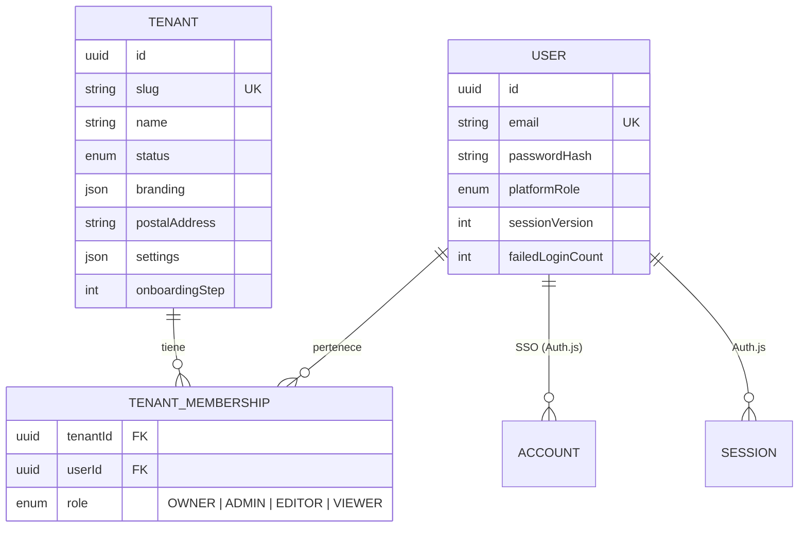

# Documento técnico de MC Send Notify

Autor: **Ing. Heri Espinosa**

## 1. Decisiones de arquitectura

| ADR                                            | Decisión                                                                                   |
| ---------------------------------------------- | ------------------------------------------------------------------------------------------ |
| [0001](adr/0001-single-project-with-worker.md) | Proyecto único de Next.js con el worker en `src/worker`, sin monorepo                      |
| [0002](adr/0002-inline-css-in-emails.md)       | El HTML de los correos usa CSS en línea; la regla "sin estilos inline" aplica solo a la UI |
| [0003](adr/0003-seaweedfs-object-storage.md)   | SeaweedFS sustituye a MinIO como almacenamiento S3 compatible                              |

Otras decisiones de la Fase 0:

- **Imágenes Debian (glibc) en todas las etapas de Docker.** Las dependencias nativas, como argon2 o sharp, se instalan y se ejecutan sobre la misma libc.
- **Puertos propios en desarrollo:** app 3020 y PostgreSQL 5452. Así no chocan con otros proyectos de la misma máquina (MCLog, MCSupport).
- **ESLint 9:** los plugins de `eslint-config-next` 16 aún no soportan ESLint 10.

## 2. Variables de entorno

[src/common/config/env.ts](../src/common/config/env.ts) valida las variables con Zod. Lo hace de forma perezosa: la app las valida al arrancar desde `instrumentation.ts` y el worker en su bootstrap. Una configuración inválida detiene el proceso con un mensaje que nombra la variable.

| Variable                      | Obligatoria                  | Descripción                                                             |
| ----------------------------- | ---------------------------- | ----------------------------------------------------------------------- |
| `NODE_ENV`                    | No (`development`)           | Modo de ejecución                                                       |
| `APP_ENV`                     | No (`development`)           | `development`, `staging` o `production`; también es el entorno en MCLog |
| `APP_URL`                     | No (`http://localhost:3020`) | URL pública de la app                                                   |
| `LOG_LEVEL`                   | No (`info`)                  | Nivel mínimo de log                                                     |
| `DATABASE_URL`                | Sí                           | URL de PostgreSQL                                                       |
| `REDIS_URL`                   | Sí                           | URL de Redis, con contraseña                                            |
| `GOTENBERG_URL`               | Sí                           | URL del servicio de conversión                                          |
| `WORKER_HEALTH_PORT`          | No (`9464`)                  | Puerto del servidor de salud del worker                                 |
| `MCLOG_URL` y `MCLOG_API_KEY` | No (juntas)                  | Envío de logs `warn` o superiores a MCLog                               |
| `MCLOG_APPLICATION`           | No (`mc-send-notify`)        | Nombre de aplicación en MCLog                                           |

`.env.example` documenta además las variables que se validarán en fases posteriores: S3, Auth.js, cifrado, tracking, correo del sistema e IA. `pnpm setup` genera todos los secretos con `crypto.randomBytes` y nunca los imprime.

## 3. Modelo de datos (Fase 0)

Convenciones del modelo:

- Identificadores UUIDv7, ordenables por tiempo.
- `createdAt` y `updatedAt` en todas las tablas.
- Tablas y columnas en `snake_case`.
- `tenantId` en toda tabla de negocio.

El cliente Prisma se genera en `src/infrastructure/persistence/prisma/generated`, que no se versiona y se regenera en `postinstall`.

## 4. Servicios y salud

| Endpoint                    | Tipo                 | Respuesta                                                |
| --------------------------- | -------------------- | -------------------------------------------------------- |
| `GET /api/health`           | Liveness             | `200` si el proceso web responde                         |
| `GET /api/health/ready`     | Readiness            | `200` o `503` según las dependencias críticas            |
| `GET :9464/health` (worker) | Liveness y readiness | `200` si Redis está conectado y todos los workers corren |

La readiness distingue dos tipos de dependencias:

- **Críticas:** PostgreSQL y Redis.
- **Informativas:** Gotenberg y el latido del worker.

La respuesta pública solo indica `up` o `down`. El detalle del error va a los logs, para no exponer hosts ni cadenas de conexión.

## 5. Observabilidad

- **pino** escribe JSON en stdout, con `service` (`web` o `worker`) y el `traceId` del contexto activo (AsyncLocalStorage).
- **Redacción** de `password`, `apiKey`, `credentials`, `secret`, `token`, `authorization` y `cookie`, en primer nivel y anidados.
- **MCLog**, si se configura, recibe por lotes los registros `warn` o superiores:
  - el lote se envía cada 5 s o al llegar a 200 entradas;
  - el buffer está acotado a 1000 entradas y los descartes se cuentan;
  - la excepción se envía completa (clase, código y stack) para que MCLog agrupe los errores.
- Un fallo de MCLog nunca rompe la aplicación.
- `instrumentation.ts` registra los errores de petición con método, ruta y `traceId`.

## 6. Seguridad (OWASP)

| Control              | Implementación                                                                                                                           |
| -------------------- | ---------------------------------------------------------------------------------------------------------------------------------------- |
| CSP con nonce        | `script-src 'self' 'nonce-…' 'strict-dynamic'`, `object-src 'none'`, `frame-ancestors 'none'`, `upgrade-insecure-requests` en producción |
| Cabeceras            | HSTS, `X-Content-Type-Options`, `Referrer-Policy`, `X-Frame-Options`, `Permissions-Policy`                                               |
| Secretos             | Solo en `.env` (no versionado), generados aleatoriamente y validados con Zod                                                             |
| Logs                 | Redacción de credenciales; la readiness no expone errores                                                                                |
| TraceId              | Solo se acepta un valor entrante con formato seguro; si no, se genera uno nuevo                                                          |
| Docker               | Procesos como usuario `node` y puertos de desarrollo solo en `127.0.0.1`; en producción solo Caddy publica puertos                       |
| Cadena de suministro | `allowBuilds` explícito, antigüedad mínima de publicación de 24 h, `pnpm audit` sin High ni Critical y `overrides` documentados          |

Decisión sobre estilos: `style-src` permite `'unsafe-inline'` porque MUI, Emotion y React usan atributos `style`. El riesgo de inyección de estilos es bajo frente al de scripts, que sí exige nonce.

### Cadena de suministro (pnpm 11)

- **`allowBuilds`** ([pnpm-workspace.yaml](../pnpm-workspace.yaml)): solo `@prisma/engines`, `prisma` y `esbuild` ejecutan scripts de instalación. El resto se deniega de forma explícita.
- **`minimumReleaseAge`:** pnpm rechaza en Docker las versiones publicadas hace menos de 24 h. Por eso las dependencias se fijan a versiones con al menos un día de antigüedad.
- **`overrides`:** `mysql2` 3.24.5 y `deepmerge-ts` 8.0.2 corrigen avisos High transitivos del CLI de Prisma. Se retiran cuando Prisma los incluya.

### Redes con inspección TLS

La red corporativa intercepta TLS con la CA `multicomputos01-AUSTRIA-CA`. El Dockerfile añade al almacén del sistema los `.crt` de `docker/certs/` y activa `NODE_OPTIONS=--use-system-ca`. Nunca se usa `NODE_TLS_REJECT_UNAUTHORIZED=0`.

## 7. Tokens de diseño y accesibilidad (WCAG AA)

Colores oficiales del manual de identidad, sección "06. Colores identidad":

| Token                    | Hex       | Uso permitido                                                                                              |
| ------------------------ | --------- | ---------------------------------------------------------------------------------------------------------- |
| Azul (Pantone 308 C)     | `#005E7D` | Primario en modo claro: 7,25:1 sobre blanco                                                                |
| Amarillo (Pantone 143 C) | `#EBAD39` | Solo como fondo con texto `#1A1A1A` (8,76:1) o como decorativo; **nunca como texto sobre blanco** (1,99:1) |
| Cielo (Pantone 640 C)    | `#008CBA` | Solo texto grande sobre blanco (3,85:1); para texto normal se usa `#006F97`                                |
| Gris (Cool Gray 9 C)     | `#878785` | Bordes y elementos decorativos                                                                             |
| Primario en modo oscuro  | `#5CB8D6` | 8,28:1 sobre `#121212`                                                                                     |

Tipografía: el manual define Gotham para titulares y Calibri para medios digitales y correo. En la web se usan **Montserrat** (análoga a Gotham) y **Carlito** (métricamente compatible con Calibri), servidas por `next/font`. En los correos se usa la pila `Calibri, Carlito, "Segoe UI", Arial`.

Los contrastes se verifican con tests en [tokens.test.ts](../src/common/theme/tokens.test.ts).

## 8. Testing

| Proyecto Vitest | Alcance                                                                       | Comando         |
| --------------- | ----------------------------------------------------------------------------- | --------------- |
| `unit`          | Utilidades, configuración, tokens, observabilidad, worker y matcher del proxy | `pnpm test`     |
| `integration`   | PostgreSQL y Redis reales (desde la Fase 1)                                   | `pnpm test:int` |

El test del matcher del proxy compila el patrón con la misma función que usa Next.js. Next.js elimina las barras invertidas, y un `\.` mal puesto dejaba sin CSP ni idioma a todas las páginas salvo la raíz.

## 9. Escalabilidad

- **App web:** no guarda estado. Se puede escalar horizontalmente detrás de Caddy, porque las sesiones son JWT y el estado vive en PostgreSQL y Redis.
- **Worker:** los limitadores de BullMQ son globales vía Redis, así que se pueden añadir réplicas del worker sin superar los límites de cada proveedor de correo. Al inicio se recomienda una réplica.
- **PostgreSQL:** índices compuestos por `tenantId`. Se prevé particionado mensual de eventos de entrega y RLS como capa adicional (Fase 5).
- **Archivos:** el puerto de almacenamiento es S3 estándar. Migrar a AWS S3 o Cloudflare R2 solo cambia variables de entorno.

## 10. Problemas conocidos y soluciones

| Síntoma                                                       | Causa                                       | Solución                                                 |
| ------------------------------------------------------------- | ------------------------------------------- | -------------------------------------------------------- |
| `UNABLE_TO_GET_ISSUER_CERT_LOCALLY` en `docker compose build` | Inspección TLS de la red                    | Copiar la CA raíz a `docker/certs/`                      |
| `ERR_PNPM_MINIMUM_RELEASE_AGE_VIOLATION`                      | Versión publicada hace menos de 24 h        | Fijar la versión anterior                                |
| `ERR_PNPM_IGNORED_BUILDS`                                     | Dependencia nueva con script de instalación | Decidir `true` o `false` en `allowBuilds`                |
| `Bind for 0.0.0.0:5452 failed`                                | Puerto ocupado por otro proyecto            | Cambiar el puerto en `compose.override.yaml` y en `.env` |
| Readiness con `worker: down`                                  | El worker no está en marcha                 | `pnpm dev:worker` o `docker compose up worker`           |
